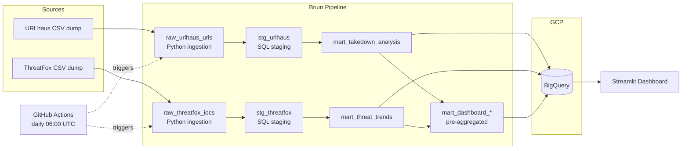

# Threat Landscape Monitor

A data pipeline that pulls cyber threat data from [abuse.ch](https://abuse.ch) feeds, loads it into BigQuery, and turns it into a dashboard you can actually use. Two questions it answers: how fast do malicious URLs get taken down, and what malware is behind them.

Live dashboard: https://threat-landscape-monitor.streamlit.app/

## What problem does this solve?

abuse.ch publishes free threat intelligence data: malicious URLs, indicators of compromise, malware samples. Good data, but raw CSV dumps. If you want to know which hosting providers take the longest to pull malware URLs, or whether Cobalt Strike activity is going up this month, you need a pipeline between the raw feeds and the answer.

This project is that pipeline. It downloads data daily from URLhaus (malicious URLs) and ThreatFox (indicators of compromise), loads it into BigQuery, runs SQL transformations, and feeds a Streamlit dashboard with two stories:

1. **Takedown time**: how long malicious URLs stay active after being reported, broken down by hosting provider. If you do incident response or abuse reporting, this is the data you want.
2. **Threat trends**: volume of reported threats over time, split by malware family. If you need to know what's active right now, start here.

## Architecture



## Tech stack

| Layer | Tool |
|---|---|
| Infrastructure as Code | Terraform |
| Cloud | GCP (BigQuery, GCS) |
| Ingestion, transformation, orchestration | Bruin |
| Data warehouse | BigQuery |
| Visualization | Streamlit + Plotly |
| CI/CD | GitHub Actions |

## Data sources

| Source | What it has | Volume | Updates |
|---|---|---|---|
| [URLhaus](https://urlhaus.abuse.ch/) | Malicious URLs used for malware distribution | ~70K URLs, full history since 2018 | Every 5 minutes |
| [ThreatFox](https://threatfox.abuse.ch/) | Indicators of compromise tied to malware families | ~175K IOCs, full history since 2020 | Every 5 minutes |

Both feeds are open. No authentication, no API keys.

## Setup and reproduction

### Prerequisites

- GCP account with billing enabled
- `gcloud` CLI authenticated (`gcloud auth application-default login`)
- [Terraform](https://www.terraform.io/)
- [Bruin CLI](https://getbruin.com/) (`curl -LsSf https://raw.githubusercontent.com/bruin-data/bruin/refs/heads/main/install.sh | sh`)

### 1. Clone the repo

```bash
git clone https://github.com/pavel-kalmykov/threat-landscape-monitor.git
cd threat-landscape-monitor
```

### 2. Provision infrastructure

```bash
cd terraform
terraform init
terraform apply
cd ..
```

Creates a BigQuery dataset (`threat_intelligence`) and a GCS bucket, both in `europe-southwest1`.

### 3. Configure Bruin

Create a `.bruin.yml` at the project root (gitignored):

```yaml
default_environment: default
environments:
  default:
    connections:
      google_cloud_platform:
        - name: "gcp-threat"
          project_id: "YOUR_PROJECT_ID"
          location: "europe-southwest1"
          use_application_default_credentials: true
```

### 4. Run the pipeline

```bash
bruin run .
```

Downloads fresh data from abuse.ch, loads it into BigQuery, runs all transformations. About a minute end to end.

### 5. Run the dashboard

```bash
uv run streamlit run dashboard.py
```

Or use the live version: https://threat-landscape-monitor.streamlit.app/

## Pipeline assets

| Asset | Type | What it does |
|---|---|---|
| `raw_urlhaus_urls` | Python | Downloads full URLhaus ZIP dump (~70K rows), parses CSV, loads to BigQuery |
| `raw_threatfox_iocs` | Python | Downloads full ThreatFox ZIP dump (~175K rows), parses CSV, loads to BigQuery |
| `stg_urlhaus` | SQL | Cleans types, extracts domain/TLD from URLs, calculates takedown time |
| `stg_threatfox` | SQL | Cleans types, splits `fk_malware` into platform and family |
| `mart_takedown_analysis` | SQL | One row per URL with takedown metrics |
| `mart_threat_trends` | SQL | Daily counts from both sources, grouped by threat type and malware family |
| `mart_dashboard_stats` | SQL | Single row with summary numbers for the dashboard |
| `mart_dashboard_takedown_monthly` | SQL | Monthly average and median takedown times |
| `mart_dashboard_domain_stats` | SQL | Per-domain takedown aggregates |
| `mart_dashboard_ioc_types` | SQL | IOC type breakdown from ThreatFox |

## Dashboard

Live at https://threat-landscape-monitor.streamlit.app/

Dark and light mode (toggle in top right corner). Interactive filters on the hosts chart. Hover over (or long press on mobile) any block in the malware treemap to see what that family actually does.

## License

MIT
